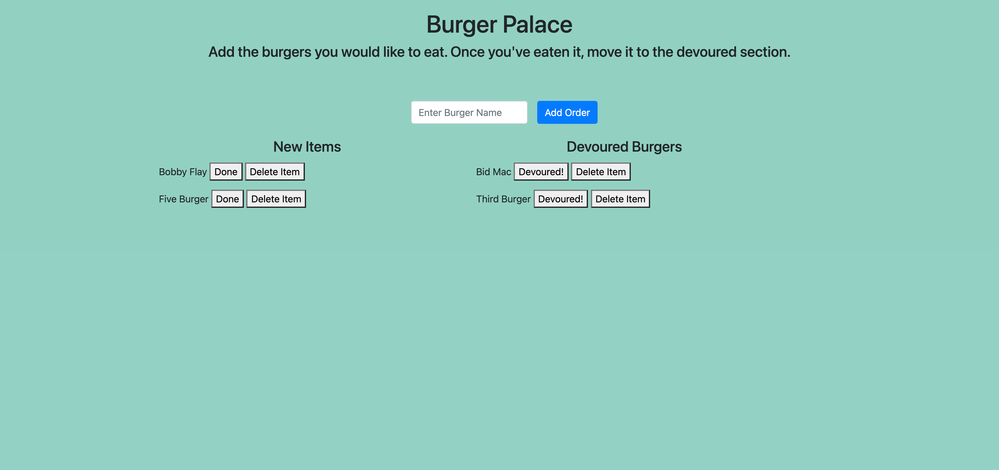

## Eecommerce-backend

## Description

This application allows the user to add new items to the page and update existing ones. Once you add an item you can click done to let us know you have already used it (or "eaten" it in this case. The app was built using Node js packages (MySQl, Express and Express Handlebars.

REFRESH THE DEPLOYED LINK A FEW TIMES IN CASE IT DOES NOT LOAD. HEROKU HAS LIMITED CAPACITY FOR UNPAID ACCOUNTS. I MEAN IT, GIVE IT SOME TIME IF IT'S NOT LOADING THE FIRST TIME.
https://vast-journey-90317.herokuapp.com/




## Contributing

Pull requests are welcome. 

## Tests

```bash

No tests required 

```

## License

### MIT License

